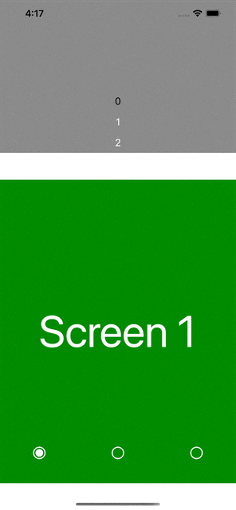

# react-native-viewpager
Viewpager is a component that allows you to swipe horizontaly between the children componnents<br/>
It's a full typescript responsive component that uses reanimated 2.<br/>
The work is still in progress but you can use it and improve it if you want! PR are welcome.<br/>
<br/>
<a align="center" href="https://www.npmjs.com/package/@grean/react-native-viewpager">
  
</a>

## Demo
### Works on both iPhone and Android


## Installation
Using yarn:

```sh
yarn add @grean/react-native-viewpager
```

## Usage
You can control the viewpager value with the ```index``` prop.<br/>
When you manually change the value, ```onChanged``` callback will be called.<br/>
Navigation is made of SVG.

```tsx
const currentItemIndex = 1
const [index, setIndex] = useState(currentItemIndex);

const onChanged = (newIndex: number) => {
  setIndex(newIndex)
}

//removed code for brevety
<ViewPager
  {...{
    style: {
      flex: 1,
    },
    index,
    navigationHeight: 0.075,
    onChanged,
  }}
>
  <View style={styles.page}>
    <Text style={styles.text}>Screen 1</Text>
  </View>
  <View style={styles.page}>
    <Text style={styles.text}>Screen 2</Text>
  </View>
  <View style={styles.page}>
    <Text style={styles.text}>Screen 3</Text>
  </View>
</ViewPager>
```

## Component props
```tsx
interface ViewPagerProps {
  children: React.ReactNode[] //All views that you want to swipe
  index: number //0: Initial index at startup
  navigation?: boolean //true: If you want to display the navigation bar
  navigationHeight?: number //0.1: Pourcentage of the viewpager container to define the height of the navigation bar
  onChanged?: (index: number) => void //Callback invocked when manually change the current child view
  pointColor?: number[] //[255,255,255]: Color of the navigation point whith [R,G,B] values
  pointRadius?: number //6: Value that divide the height of the navigation bar to define the radius of the dot that represent the current selected view
  tickColor?: number[] //[255,255,255]: Color of the navigation ticks whith [R,G,B] values
  tickRadius?: number //4: Value that divide the height of the navigation bar to define the radius of the ticks that represent each child view
  strokeWidth?: number //2: Value that define the strokeWidth svg prop of the tick component
  style: ViewStyle //All RN view style props
}
```

## Testing
See Expo example app for testing with hot-reload, you can directly modify the code's component and see how your modifications looks like immediately.
```sh
git clone https://github.com/grean/react-native-viewpager.git
cd react-native-viewpager && yarn
cd example && yarn
yarn ios
```

## About
If you want to eat well and healthy, i recommand you to check out our mobile app [Dietethic.net](https://dietethic.net)<br/>

<a align="center" href="https://github.com/grean?tab=followers">
  
</a>
<br />
<a align="center" href="https://twitter.com/reanGuillaume">
  
</a>

## License 
MIT
